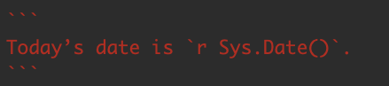
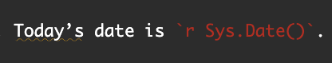
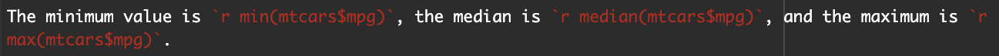
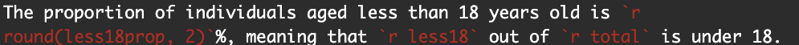

```{r setup, include=FALSE}
knitr::opts_chunk$set(echo = TRUE, warning=FALSE, message=FALSE)
```

<style type="text/css">

body, td {
   font-size: 20px;
}
code.r{
  font-size: 16px;
}
pre {
  font-size: 16px
}
body {
text-align: justify}
</style>

All the content of this tutorial has been extracted from [this book](https://bookdown.org/yihui/rmarkdown/), [this tutorial](https://epirhandbook.com/new_pages/rmarkdown.html) and with the unconditional assistance of chatgpt.   

# What is RMarkdown?

Markdown is a “language” that allows us to write a document using plain text, that can be converted to html and other formats. It is not specific to R. Files written in Markdown have a `.md` extension.

R Markdown is a variation on markdown that is specific to R - it allows us to write a document using markdown to produce text and to embed R code and display their outputs. R Markdown files have `.Rmd` extension.

`rmarkdown` is the package used by R to render the `.Rmd` file into the desired output. It’s focus is converting the markdown (text) syntax, so we also need `knitr`, the R package that will read the code chunks, execute it, and ‘knit’ it back into the document. This is how tables and graphs are included alongside the text.
`Pandoc`is the program actually converting the output into word/pdf/powerpoint etc. It is a software separate from R but is installed automatically with RStudio.

<center>


</center>

In sum, the process that happens in the background (you do not need to know all these steps!) involves feeding the .Rmd file to knitr, which executes the R code chunks and creates a new .md (markdown) file which includes the R code and its rendered output. The .md file is then processed by pandoc to create the finished product: a Microsoft Word document, HTML file, powerpoint document, pdf, etc.

<center>


</center>

# Installing RMarkdown

To run RMarkdown we need to have R installed (https://www.r-project.org) (R Core Team 2023) and the RStudio IDE (https://www.rstudio.com). RStudio is not required but recommended, because it makes it easier for an average user to work with R Markdown. If we do not have RStudio IDE installed, we will have to install Pandoc (http://pandoc.org), otherwise there is no need to install Pandoc separately because RStudio has bundled it. Next we can install the rmarkdown package in R:

```{r instalaltion, eval=F}
# Install from CRAN
install.packages('rmarkdown')

# Or if we want to test the development version,
# install from GitHub
if (!requireNamespace("devtools"))
  install.packages('devtools')
devtools::install_github('rstudio/rmarkdown')
``` 

If we want to generate PDF output, we will need to install `LaTeX`, one way to start could be using `TinyTeX` (https://yihui.name/tinytex/):

```{r LateX,  eval=F}
install.packages('tinytex')
tinytex::install_tinytex()  # install TinyTeX
```

With the rmarkdown package, RStudio/Pandoc, and LaTeX, we should be able to compile most R Markdown documents. In some cases, we may need other software packages.

# Setting Up RMarkdown

To create an RMarkdown document in RStudio:

1. Click **File** > **New File** > **R Markdown**.

<center>

</center>

2. Choose **Document** and select **HTML** output.

<center>


</center>

3. Click **OK** to generate a template.

# Parts of a RMarkdown 

An R Markdown document has three basic "parts": YAML, Markdown text, and code chunks.


We are now going to explore these different parts a bit more in detail.

## YAML metadata

Referred to as the ‘YAML metadata’ or just ‘YAML’, this is at the top of the R Markdown document. This section of the script will tell our Rmd file what type of output to produce, formatting preferences, and other metadata such as document title, author, and date. There are other uses not mentioned here (but referred to in ‘Producing an output’). Note that indentation matters; tabs are not accepted but spaces are.

This section must begin with a line containing just three dashes --- and must close with a line containing just three dashes ---. YAML parameters comes in key:value pairs. The placement of colons in YAML is important - the key:value pairs are separated by colons (not equals signs!).

The YAML should begin with metadata for the document. The order of these primary YAML parameters (not indented) does not matter. For example:

```{yaml yaml_code, eval=FALSE}
title: "My document"
author: "Me"
date: "2024-09-18"
```
we can use R code in YAML values by writing it as in-line code (preceded by r within back-ticks) but also within quotes (see above example for `date:`).

In the image above, because we clicked that our default output would be an html file, we can see that the YAML says `output: html_document`. However we can also change this to say `powerpoint_presentation` or `word_document` or even `pdf_document`.

You will notice that I used in these case a longer code:

```{yaml my_yaml_code, eval=FALSE}   
      toc: true
      toc_float: true
      theme: paper
      highlight: pygments
      code_folding: show
      df_print: paged
bibliography: references.bib
csl: apa.csl
```

These parts are simply formatting details for the document: 

- `toc: true`: Adds a table of contents at the beginning of our document.
- `toc_float: true`: Makes the TOC float on the side of the page as we scroll (useful for navigation in long documents).
- `theme: paper`: Sets the theme of the HTML document. The "paper" theme provides a clean, simple, and minimalistic look.
- `highlight: pygments`: Specifies the syntax highlighting style for code blocks. "pygments" is one of the available styles for code syntax highlighting.
- `code_folding: show`: Allows code folding, meaning users can collapse or expand code chunks in the knitted HTML output. "show" means the code is visible by default but can be hidden by clicking a button.
- `df_print: paged`: When printing data frames in the HTML output, this setting displays them in a paged table format with pagination (rather than printing them as plain text). This is useful for handling large data frames.
- `bibliography: references.bib` and `csl: apa.csl` are related to the bibliography and will be explained later.

## Text

This is the narrative of our document, including the titles and headings. It is written in the “markdown” language, which is used across many different software.

Below are the core ways to write this text. See more extensive documentation available on R Markdown “cheatsheet” at the RStudio website.

### New lines

Uniquely in R Markdown, to initiate a new line, enter *two spaces** at the end of the previous line and then Enter/Return.  

### Case

Surround our normal text with these character to change how it appears in the output.

- **Bold**: `**bold text**`
- *Italic*: `*italic text*`
- `Monospace`: `` `code` ``
- Bullet points: `- Item 1`, `- Item 2`
- Headers: `# Heading 1`, `## Heading 2`, `### Heading 3`
- Blockquotes:
  > This is a blockquote.
  

The actual appearance of the font can be set by using specific templates (specified in the YAML metadata).

### Color

There is no simple mechanism to change the color of text in R Markdown. One work-around, IF our output is an HTML file, is to add an HTML line into the markdown text. The below HTML code will print a line of text in bold red.

```{html}
<span style="color: red;">**_DANGER:_** This is a warning.</span>  
``` 

<span style="color: red;">**_DANGER:_** This is a warning.</span>  

### Titles and headings

A hash symbol in a text portion of a R Markdown script creates a heading. This is different than in a chunk of R code in the script, in which a hash symbol is a mechanism to comment/annotate/de-activate, as in a normal R script.

Different heading levels are established with different numbers of hash symbols at the start of a new line. One hash symbol is a title or primary heading. Two hash symbols are a second-level heading. Third- and fourth-level headings can be made with successively more hash symbols.

### Bullets and numbering

Use asterisks (*) to created a bullets list. Finish the previous sentence, enter two spaces, Enter/Return twice, and then start our bullets. Include a space between the asterisk and our bullet text. After each bullet enter two spaces and then Enter/Return. Sub-bullets work the same way but are indented. Numbers work the same way but instead of an asterisk, write 1), 2), etc. Below is how our R Markdown script text might look.

Here are my bullets (there are two spaces after this colon):  

* Bullet 1 (followed by two spaces and Enter/Return)  
* Bullet 2 (followed by two spaces and Enter/Return)  
  * Sub-bullet 1 (followed by two spaces and Enter/Return)  
  * Sub-bullet 2 (followed by two spaces and Enter/Return)  

### Images

we can include images in our R Markdown one of two ways:

```
  
```

If the above does not work, try using `knitr::include_graphics()`

```
knitr::include_graphics("path/to/image.png")
```

### Tables

Create a table using hyphens ( - ) and bars ( | ). The number of hyphens before/between bars allow the number of spaces in the cell before the text begins to wrap.

This code:


produces this table: 

Column 1 |Column  2 |Column 3
---------|----------|--------
Cell A   |Cell B    |Cell C
Cell D   |Cell E    |Cell F

we can also add tables using the `knitr::kable` function:

```{r table example}
library(knitr)
df <- data.frame(Name = c("Alice", "Bob"), Age = c(25, 30))
kable(df)
```


### Mathematical Equations 

RMarkdown supports LaTeX-style mathematical equations. we can write inline equations using `$...$`, like this: $N_{t+1} = N_t e^{rt}$. 

For display equations, use double dollar signs:

$$
N_{t+1} = N_t e^{rt}
$$

where:

- \( N_t+1 \) is the population at time \( t+1 \),
- \( N_t \) is the initial population,
- \( r \) is the growth rate,
- \( t \) is time.

### Links 

We can provide links to websites using the following inline code. 

```
[This is my webpage](https://polcapdevila.weebly.com/)
```

That code will render. [This is my webpage](https://polcapdevila.weebly.com/). 

### Citing Papers 

We can cite papers using a bibliography file in BibTeX format. First, create a file called `references.bib`. 

In RStudio, go to File > New File > Text File. Copy and paste the following BibTeX entry format into the new file:

```
@article{smith2020,
  author = {John Smith},
  title = {An Introduction to RMarkdown},
  journal = {Journal of R},
  year = {2020},
  volume = {10},
  pages = {1-10}
}
```
Save the file as `references.bib` in the same directory as our RMarkdown document.

Then, we can cite the paper in our document using `@smith2020`, like this:

> RMarkdown is a great tool for reproducible research [@smith2020].

The references will be automatically formatted at the end of our document.

For this to work make sure we have the `apa.csl` file in the same directory as our RMarkdown document. If we don’t have it, we can download it from the Zotero repository:

1. Go to [CSL Repository](https://www.zotero.org/styles?q=apa). 
2. Search for APA (American Psychological Association) 7th edition.
3. Download the `.csl` file.
4. Place it in the same folder as our `.Rmd` file.


## R Code in RMarkdown

Sections of the script that are dedicated to running R code are called “chunks”. This is where we may load packages, import data, and perform the actual data management and visualisation. There may be many code chunks, so they can help we organize our R code into parts, perhaps interspersed with text. To note: These ‘chunks’ will appear to have a slightly different background colour from the narrative part of the document.

Each chunk is opened with a line that starts with three back-ticks (```), and curly brackets that contain parameters for the chunk ({ }). The chunk ends with three more back-ticks.

Some notes about the contents of the curly brackets { }:

They start with ‘r’ to indicate that the language name within the chunk is R. After the r we can optionally write a chunk “name” – these are not necessary but can help we organise our work. Note that if we name our chunks, we should ALWAYS use unique names or else R will complain when we try to render.

The curly brackets can include other options too, written as tag=value, such as:

- `eval = FALSE` to not run the R code.
- `echo = FALSE` to not print the chunk’s R source code in the output document.
- `warning = FALSE` to not print warnings produced by the R code.
- `message = FALSE` to not print any messages produced by the R code.
- `include = either TRUE/FALSE` whether to include chunk outputs (e.g. plots) in the document.
- `out.width =` and `out.height =` provide in style out.width = "75%".
- `fig.align = "center"` adjust how a figure is aligned across the page.
- `fig.show='hold'` if our chunk prints multiple figures and we want them printed next to each other (pair with  `out.width = c("33%", "67%")`). Can also set as `fig.show='asis'` to show them below the code that generates them, 'hide' to hide, or 'animate' to concatenate multiple into an animation.
- A chunk header must be written in one line.
- Try to avoid periods, underscores, and spaces. Use hyphens ( - ) instead if we need a separator.

[More here](https://yihui.org/knitr/options/).

Some of the above options can be configured using the setting buttons at the top right of the chunk. Here, we can specify which parts of the chunk we want the rendered document to include, namely the code, the outputs, and the warnings. This will come out as written preferences within the curly brackets, e.g. `echo=FALSE` if we specify we want to ‘Show output only’.


For global options to be applied to all chunks in the script, we can set this up within our very first R code chunk in the script. For instance, so that only the outputs are shown for each code chunk and not the code itself, we can include this command in the R code chunk:

```{r example, eval=FALSE}
knitr::opts_chunk$set(echo = FALSE) 
```

### Run basic code 

To run R code in an RMarkdown document, use R code chunks. A basic chunk looks like this:

```{r caculation}
# Simple Calculation
2 + 2
```

we can also assign variables and print output:
```{r object}
x <- 10
y <- 5
x * y
```

We can also read the data stored in folders that we can access to.

```{r read_data}
bird_pops <- read.csv(file="data/bird_pops.csv")
```


### Plotting in RMarkdown

We can embed plots using `ggplot2` or base R plotting functions.

```{r figure, fig.width=5, fig.height=4}
library(ggplot2)
ggplot(mtcars, aes(x = mpg, y = hp)) +
  geom_point() +
  theme_minimal()
```

### Wide Code Blocks
Use `tidy = TRUE` to ensure readable formatting in long code blocks:

```{r wide_code, tidy=TRUE}
# A longer code snippet
long_vector <- rep(1:10, each=3)
summary(long_vector)
```

### In-text R code

One interesting feature of RMarkdown is that it can embeb results from code in the text, which is particularly useful for reports. For example, one could write the current date using the code separated by "``". See the following example. 

```
Today’s date is `r Sys.Date()`.
```

The code looks like:



We can also do it inline. Like this. Today’s date is `r Sys.Date()`.

This looks like:


The example above is simple (showing the current date), but using the same syntax, we can display values produced by more complex R code. For example, calculating the min, median, and max of a result. For this example we will use the dataset `mtcars` from bas R. 

The minimum value is `r min(mtcars$mpg)`, the median is `r median(mtcars$mpg)`, and the maximum is `r max(mtcars$mpg)`.

The code looks like: 




We can also integrate R objects or values that were created in R code chunks earlier in the script. As an example, the script below calculates the proportion of cases that are aged less than 18 years old using tidyverse functions, and creates the objects `less18`, `total`, and `less18prop`. This dynamic value is inserted into subsequent text.

```{r example age}
library(dplyr)
# Example dataset
data <- data.frame(age = c(10, 25, 5, 40, 15, 18, 30, 12, 8, 50))

# Calculate proportion under 18
less18 <- data %>% filter(age < 18) %>% nrow()
total <- nrow(data)
less18prop <- less18 / total * 100
```

Now, we can reference this dynamically in text:

The proportion of individuals aged less than 18 years old is `r round(less18prop, 2)`%, meaning that `r less18` out of `r total` is under 18.

Which looks like: 



### Tabbed sections

For HTML outputs, we can arrange the sections into “tabs”. Simply add .tabset in the curly brackets { } that are placed after a heading. Any sub-headings beneath that heading (until another heading of the same level) will appear as tabs that the user can click through. 

### Tabbed section {.tabset}

#### Distribution 

```{r distribution}

ggplot(iris,aes(x=Sepal.Length))+
  geom_density(fill="steelblue", alpha=.5, colour=NA)+ 
  theme_bw()

```

#### Boxplot 

```{r boxplot}

ggplot(iris,aes(x=Sepal.Length, y=Species, group=Species, fill=Species))+
  geom_boxplot(alpha=.5)+ 
  theme_bw()

```

### Using code within a report 

One powerful way to use R Markdown is to use code from other scripts. This can make our R Markdown script less cluttered, more simple, and easier to organize. It can also help if we want to display final figures at the beginning of the report. In this approach, the final R Markdown script simply combines pre-processed outputs into a document.

One way of doing this is by providing the R scripts (file path and name with extension) to the base R command `source()`.

In this example, I will load a script that uses a function to simulate a population, projects it 100 years, and then it plots it. 

```{r source}
source("scripts/population_simulation.R")

print(pop_plot)

```

As we can see I could recover the plot created, but that's not all of it. I can reuse the function. 

```{r sim}

proj_pop2 <- pop_proj(growth = 0.1,tmax = 50)

ggplot(proj_pop2, aes(x=time, y=n))+
  geom_point()+ geom_line()+
    theme_bw()


```

Or we can also refer to the results from the code. For example, explore the abundance of the population at time 50. 

```{r reppop}

proj_pop$n[50]

```

We can use the inline text citation to say that the abundance at time 50 was `r proj_pop$n[50]`. 

# References 
